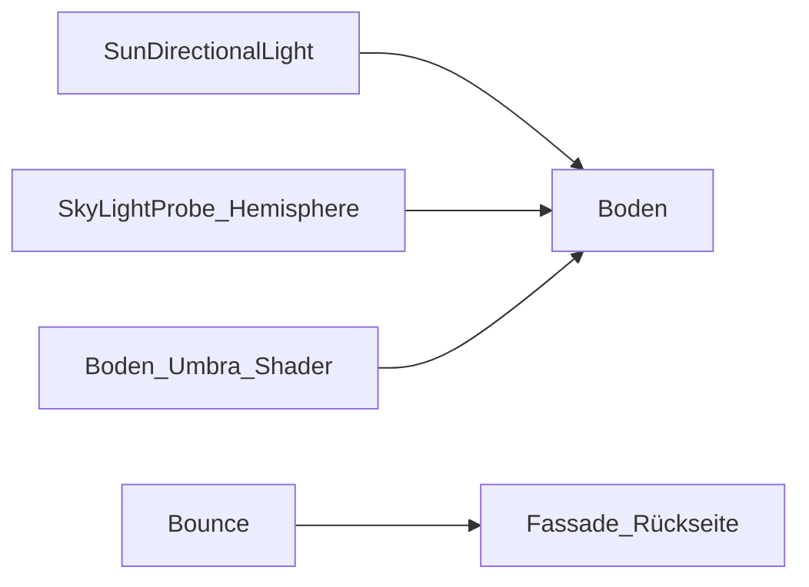

# Mehrschichtige Lichtstimmung

Außenbeleuchtung in **3D** und **Oben** als Schichtenmodell — näher an realer Architektur-Fotografie als eine einzelne Shadow-Map.

## Nutzer

- **Bodenschatten:** eine Shadow-Map (PCSS in Render); kein zweiter Umbra-Pass am Boden (v0.7.330).
- **Dämmerung:** goldene/blaue Stunde über physikalischen Himmel (Takram), kein harter Lichtwechsel.
- **Schattenfassade:** kühles Himmelslicht + warmes Bodenreflex-Licht von unten (nicht pechschwarz).
- **Slider:**
  - **Umgebungslicht** → Himmel-Fill (Hemisphere + SkyLightProbe)
  - **Schatten-Kontrast** → Licht/Schatten an Fassade und Himmel
  - **Schatten-Weichheit** → PCSS-Randschärfe live (**nur Render**)
  - **Farbtemperatur** → Key-Lichtfarbe (Kelvin; Himmel bleibt physikalisch)
  - **Schatten-Dunkelheit** → aus UI entfernt (Legacy in gespeicherten Projekten)

## Schichten

| Schicht | Quelle | Schatten |
|---|---|---|
| Key (Sonne/Mond) | `SunDirectionalLight` (`dirLight`) | Ortho-Map, PCSS (`BasicShadowMap`) |
| Himmel | `SkyLightProbe` + `HemisphereLight` | — |
| Bodenreflex | `bounceDirLight` (2. Directional, Index 1) | nein |
| Boden-Umbra | Shader auf Bodenplatte | Albedo×Ambient-Fill; Schatten wie überall (PCSS) |
| Punktlicht (Bibliothek) | `SceneLightRuntime` / `state.sceneLights` | Cube-Map (512), Render + Schatten optional |



## Betroffene Dateien

| Datei | Rolle |
|---|---|
| `src/utils/lightingMood.ts` | `resolveLightingMood` — Intensitäten/Farben aus Sonne + Szenenfarben |
| `src/lighting/groundMood.ts` | Boden-Umbra-Shader (`ground-mood-v5`, Albedo × Sonnen-Ambient) |
| `src/lighting/pcssShadows.ts` | PCSS-ShaderChunk |
| `src/lighting/atmosphereSky.ts` | Takram-Himmel + Key-Light |
| `src/scene/sceneLights.ts` | Persistente Punktlichter (Bibliothek, v2.0.27) |
| `src/lighting/sceneLightRuntime.ts` | THREE.PointLight + Marker-Kugel |
| `src/main.ts` | `applySunLighting`, `renderLitSceneFrame`, Bloom |

## Datenfluss

```
sunSettings + Szenenfarben
  → resolveCelestialState (Schatten-Entscheidung)
  → resolveLightingMood
  → atmosphereSky.update (SunDirectionalLight am Gebäudeziel, SkyMaterial, Sterne)
  → hemiLight (Horizont + Nutzer-Boden, volle Mood-Intensität) + bounceDirLight
  → groundMat: Albedo = Bodenfarbe, Irradiance = Sonnen-Ambient (`ground-mood-v5`)
```

## Slider-Mapping

| Slider | Wirkung |
|---|---|
| `#sun-intensity` | Key-Intensität (× Slider-Normierung) |
| `#sun-color-temp` | Key-Lichtfarbe in Kelvin (2700–8000); Himmel bleibt physikalisch |
| `#sun-ambient` | Hemisphere + SkyLightProbe |
| `#sun-shadow-contrast` | Fassaden-Gegenlicht, Himmel-Fill |
| `#sun-softness` | PCSS-Penumbra live über Uniform `pcssLightSizeUv` (nur Render; UI ausgeblendet in Entwurf/Vorschau) |

## Bekannte Grenzen

- Kein Full-GI / kein SSAO (Performance, Bloom, Orbit-Lite).
- Paneele empfangen weiter keine Shadow-Map (Moiré).
- Kein Kontakt-RT mehr unter dem Gebäude (nur Shadow-Map-Umbra).
- **Boden-Shader (v0.7.343):** wieder `ground-mood-v5` — Albedo×Ambient-Fill plus Umbra-Sampling in der Shadow-Map (wie vor den heutigen Schatten-Experimenten).
- **Punktlichter (v2.0.27):** Bibliothek → „Licht“ → Punktlicht einfügen; in 3D anklicken; Position X/Y/Z in der rechten Toolbar. Gespeichert in `FacadeState.sceneLights`. Marker-Kugel sichtbar; Schatten nur im Render-Modus.
- **Bloom (v2.0.27):** Checkbox wirkt in der **3D-Ansicht** (Entwurf/Vorschau/Render), nicht im Linienmodus und nicht in 2D-Ansichten.
